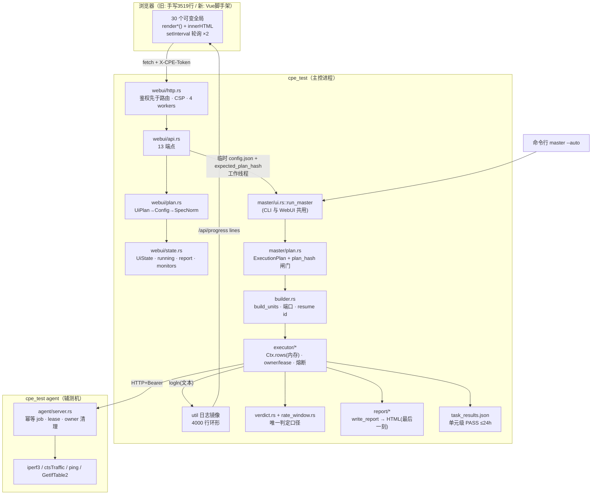
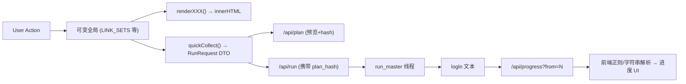
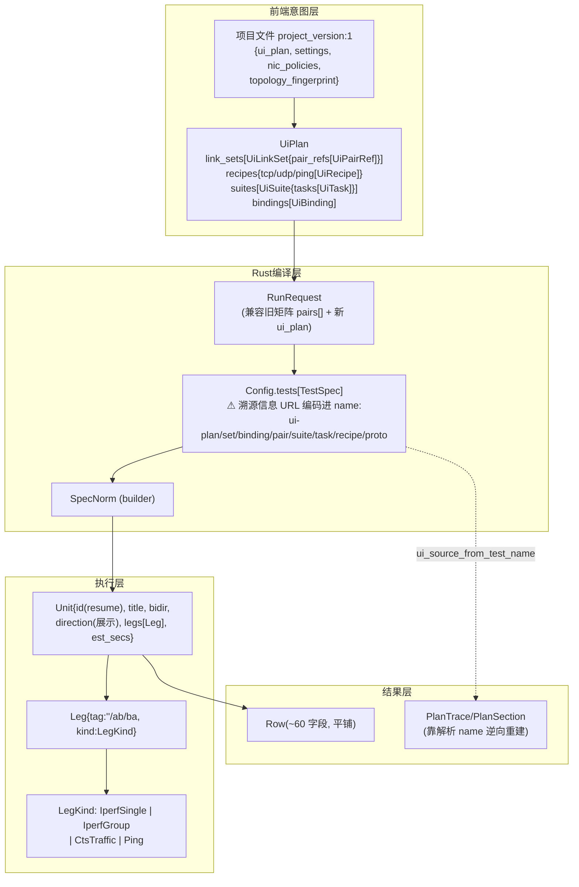
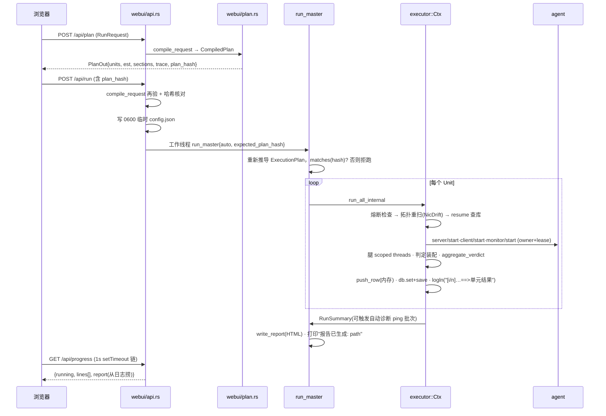
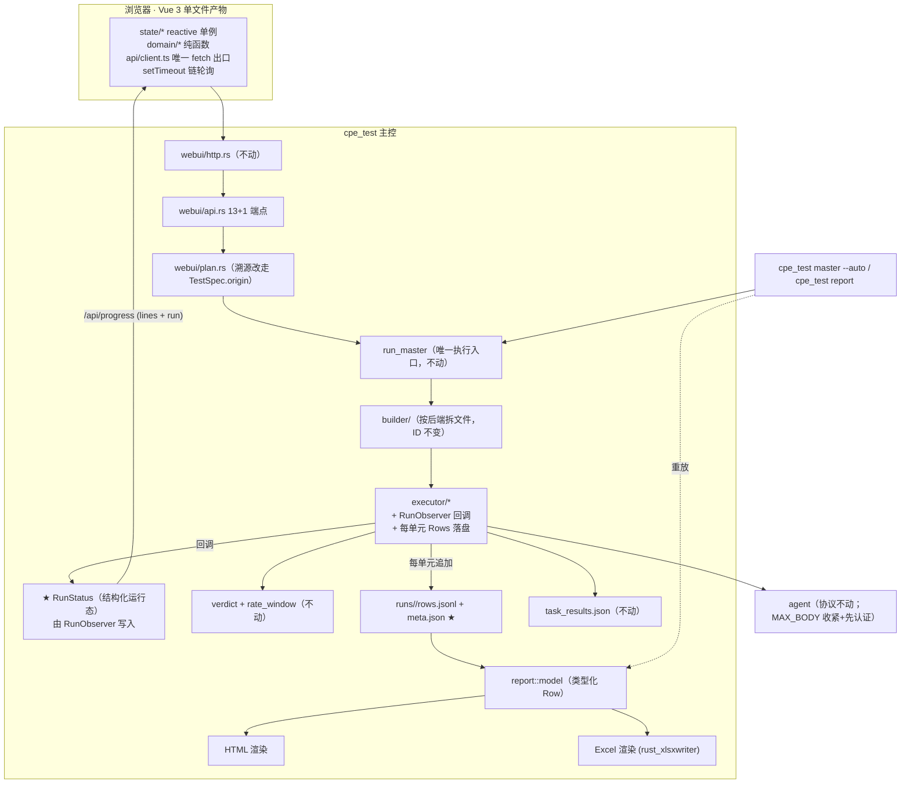

# DESIGN v6.0 · CPE Test Architecture

> 基线：`feat/webui-vue` @ `4d6b4bb`（v4.6.0 之后，v5.0 前端迁移 P0 期进行中）。
> 本文是对**整个系统**（WebUI、Master、Agent、计划、执行、进度、报告、鉴权、构建、CI）
> 的一次完整重新设计，产出自一轮全仓源码审计（§2 列出读过的东西），不是对 v5.0 的续写。
>
> 与既有文档的关系：
> - `.ai/PROJECT_ARCHITECTURE.md` 仍是「现状索引」，本文不重复它；
> - `.ai/DESIGN-v5.0-webui.md` + `.ai/PLAN-v5.0-frontend.md` 的**前端选型与分期大体被本文确认**，
>   被推翻/修订的条目在 §20 ADR 里逐一列出（最重要的一条：进度不再靠前端解析日志行，见 ADR-2）；
> - 引用约定沿用仓库规则：**只引模块路径与符号名，不写行号**（行号会烂，定位用
>   `grep -n "fn <符号>" <文件>`）。

---

## 1. Executive Summary

审计结论先行：**这个仓库的 Rust 核心比「重写」叙事所暗示的健康得多。**
判定唯一性（`verdict::aggregate_verdict` + 结构断言）、速率口径唯一性（`master::rate_window`）、
预览/执行同一性（`master::plan::ExecutionPlan` + `plan_hash` 闸门）、协议的
request_id/owner_id/lease 生命周期、resume 的长度编码 identity——这些是很多同类工具做不到的
纪律。v6.0 的任务**不是推倒重来，而是把四条真正的结构性短板补上**：

1. **进度是文本，不是数据。** `ProgressOut` 只有 `{running, from, lines, report}`；
   报告路径靠在日志里搜「报告已生成: 」捞出来（`webui/api.rs::api_progress`）；v5.0 计划让前端
   去解析 `[i/total]` 和「==> 单元结果:」两种日志行来拼单元级进度。一次 11.5 小时、210 单元的
   测试，其全部结构化状态（当前单元、PASS/FAIL 计数、失败清单、ETA）都要从三万行日志文本里
   反推——而这些状态在 executor 里**本来就是结构化的**（`RunSummary`、每个单元的
   `aggregate_unit_verdict`）。v6.0 让 Rust 直接吐结构化 `RunStatus`（ADR-2）。
2. **结果只活在内存里。** `Ctx.rows` 是 `Mutex<Vec<Row>>`，`write_report` 在整轮结束时才落盘
   （`master/ui.rs::run_master` 尾部）。主控在第 10 小时崩溃/断电/被 kill，只剩
   `task_results.json` 里的单元级 PASS 布尔——十小时的测量数据、原因码、方向明细全部蒸发。
   v6.0 每个单元结束即把该单元的 Rows 追加落盘（JSONL），报告改为**可从落盘数据重放**（ADR-3）。
3. **判定装配层已经三链分叉。** 铁律守住了聚合优先级（`aggregate_verdict`）和速率统计
   （`rate_window`），但两者之间的「腿级装配」有三份实现，且对同一事实已给出不同结论：
   Observe/Discover 模式下 UDP 链拿目标判 FAIL 而 TCP/CTS 链不会；「无测量」三链三个
   verdict；防「发送端瓶颈误判为 CPE 失败」的 offered 口径只有 UDP 链有（§4.5）。
   这与历史上两次静默错判同型——v6.0 把装配层收敛成共享骨架 + 防分叉断言（ADR-12）。
4. **canonical result model 有骨架、缺类型。** `Row` 是唯一结果模型（好），但报告层靠字符串
   推断结构：方向从 `kind_label` 里搜 `-ab`/`-ba`（`report/model.rs::infer_direction_tag`）、
   ping 靠标题含 `PING`、UDP 靠标题含 `UDP`（`group_is_ping` / `group_is_udp`）。Excel 报告
   即将成为第二个消费者，字符串推断会把同一批脆弱性复制一份。v6.0 给 `Row` 补上类型化的
   direction/protocol/backend/link_group/src_side/dst_side 字段，HTML/Excel/API 三个出口同源
   （ADR-7）。

前端方向**维持 v5.0**：Vue 3 + TS + Vite + `vite-plugin-singlefile`、无 Pinia、无 vue-router、
无 WebSocket/SSE、产物全内联提交进仓库。本次审计独立验证了它的根因链条
（鉴权先于路由 ⇒ 子资源必 401 ⇒ 必须单文件；CSP 无 `unsafe-eval` ⇒ 必须预编译），
这不是偏好，是被 `master/webui/http.rs::handle` 的代码结构决定的（ADR-5/6）。

安全/正确性方面：近两轮 review（`.ai/REVIEW-rs-2026-08-30.md` 等）点名的重项——agent
认证前读 100 MiB body、http_client 响应无上限、iperf Bytes 进制错、工具查找缓存永久化——
**已全部在 `b3013e6` 修复**（本审计逐条复核源码确认）；仅剩两个小残留，见 §4.3。

---

## 2. Current Architecture Audit（现状审计）

### 2.1 审计范围

逐行精读：`master/webui/{http,api,model,state,plan(核心段)}.rs`、`master/{plan,executor}.rs`、
`master/executor/{progress,db}.rs`、`master/ui.rs::run_master`、`master/builder.rs`
（类型定义 + `build_units` 主循环 + resume identity）、`verdict.rs`、`report/model.rs`、
`protocol.rs`、`config.rs`（Config/TestSpec 段）、`ui/`（全部脚手架 + `emit.mjs`）、
`.github/workflows/build.yml`（quality 段）、HEAD 上的旧 `webui.html`（结构化抽样：全局状态、
render 家族、fetch 清单、轮询）。另有四路专项审计逐行覆盖：旧 `webui.html` 全文、
`executor/{udp,cts,iperf_leg,ping_leg,verdict_assembly,window,agent,artifact}.rs` +
`rate_window.rs` 公开 API、`report.rs` 渲染层 + `report/{diagnostics,format,reason}.rs`、
`agent/{server,webui}.rs` + `nic/monitor.rs`、`webui/{import,monitor,validate,tests}.rs`——
其发现已并入 §4.3–§4.5 并逐条回源码复核。仅结构掌握（借助既有文档）：`cmd/*`、`nic/scan_*`。

### 2.2 关键模块的十问速答

| 模块 | 谁拥有状态 | 业务逻辑 | UI 展示 | API/IO | 主要问题 |
|---|---|---|---|---|---|
| 旧 `webui.html`（HEAD） | 30 个顶层可变绑定 + 4 个模块级 Map/Set（`PAIRS/LINK_SETS/RECIPES/SUITES/BINDINGS/UDP_GROUPS/...`） | 大量：`qcandidatePairs`、`qroleKey`、自动分组、`quickPlanObject`/`quickCollect`（拼 UiPlan DTO）、项目文件校验 ~200 行 | 17 个渲染入口全量拼 `innerHTML`，共 125 函数 | `api()` 单出口（好） | 状态-DOM 手工同步；两处 `setInterval` |
| `master/webui/http.rs` | 无 | 无 | 无 | 路由+鉴权+CSP | 无重大问题；鉴权先于路由是全系统承重墙 |
| `master/webui/state.rs` | `Console{state,running,report,monitors}` | 少 | 无 | 无 | `UiState.cfg` 同时充当「连接配置」与「计划底稿」两个角色 |
| `master/webui/api.rs` | 写 `UiState`/`running`/`report` | `bootstrap_out` 从 `cfg.tests` **反推**默认档位（注释自陈两处坑） | 无 | 13 端点 | 反推逻辑脆；`api_progress` 从日志捞报告路径 |
| `master/webui/plan.rs` | 无 | UiPlan→Config 编译、trace 重建、`compile_request` | 无 | 无 | UI 溯源信息 URL 编码进 `TestSpec.name`（`ui_source_from_test_name`）；预览路径逐 spec 构建、哈希再按执行端方式全量重建一遍（有测试守等价） |
| `master/plan.rs` | `ExecutionPlan`（不可变） | 计划指纹（配置归一、单元 Debug 指纹） | 无 | 无 | 健康。`units_fingerprint` 用 `Debug` 有意不可持久化，已写明 |
| `master/builder.rs` | 无 | spec→Unit 展开、端口、resume identity、UDP 裁剪、est_secs | 无（但标题/label 格式化混在里面） | 无 | `build_units` 单函数 ~780 行、五层嵌套；标题/notice 文案与生成逻辑交织 |
| `master/executor.rs` + 子模块 | `Ctx{rows,db}` 内存态 | 调度、腿并发、判定装配、资源 owner/lease、熔断 | 进度**日志行**（`logln`） | agent RPC | 结果不落盘直到最后；进度只有文本 |
| `verdict.rs` / `reason.rs` | 无 | 判定词汇表+聚合优先级+处置建议（穷举测试守着） | 无 | 无 | 健康，是全仓样板 |
| `report/model.rs` + `report.rs` | 无 | 行分组、方向汇总、回退聚合（调 `aggregate_verdict`） | HTML 渲染 | 写文件 | 方向/协议/ping 靠字符串推断；`Row` ~60 平铺字段 |
| `protocol.rs` + `agent/server.rs` | agent 侧资源表 | 幂等 job、租约、owner 清理 | agent 状态页 | HTTP/JSON | 协议成熟；review 点名的「认证前读 100 MiB body」已修（`MAX_BODY` 1 MiB + 认证先于读 body，`b3013e6`） |
| `nic/monitor.rs` + `webui/monitor.rs` | 会话表（租约+心跳+空闲回收三条路） | 采样、环形缓冲、绝对游标 | 前端 canvas | `/api/monitor/*` | 主控侧健康；agent 侧样本缓冲**无上限**（§4.4-N5）、清理无超时预算（N6）；旧页 X 轴/点数口径问题已在 `b3013e6` 修复（迁移时列为不许回归项） |

### 2.3 十个关键问题的全局回答

1. **谁拥有状态？** 拓扑与连接：`UiState`（内存）；计划意图：**前端 UiPlan / 项目文件**；
   可执行计划：`ExecutionPlan`（瞬时）；运行态：`Console.running` + 日志镜像（`util::log_tail_since`，
   4000 行环形）；结果：`Ctx.rows`（内存）+ `task_results.json`（单元级 PASS）；监控：会话表。
2. **业务逻辑在哪？** 判定/展开/裁剪全在 Rust（对）；但**候选配对、角色分组、单元数估算**在旧前端
   另有一份 JS 实现（`qcandidatePairs`/`qroleKey`），与 Rust 的 `enumerate_pairs`/`PlanOut`
   构成第 7 问的重复实现。v5.0 的处置（前端只管交互态，数量/耗时以 `/api/plan` 回包为准）正确。
3. **数据如何流动？** UiPlan →（`config_from_ui_plan`）Config.tests[] →（`spec_from_config`）
   SpecNorm →（`build_units`）Unit/Leg →（executor）Row → 报告。UI 溯源逆着这条链靠
   `TestSpec.name` 编码穿透。
4. **双向依赖？** 无循环依赖；`executor → report::Row` 是「执行器构造展示行」的单向但**过宽**耦合
   （AGENTS.md §3：改报告列必须联检 executor 全部 Row 构造点）。
5. **最易状态不同步的点**：旧前端 DOM↔JS 状态（v5.0 已在解决）；`bootstrap_out` 反推默认组；
   浏览器进度态（刷新即丢，需重放日志）。
6. **事实上的稳定协议**：`protocol.rs` 全部（跨版本 agent 兼容测试钉着）、resume identity 模板、
   `task_results.json` 结构、`Row`→HTML 的列语义、`config.json` 的 serde 形状（无
   `deny_unknown_fields`，兼容面）、日志行 `[i/total]`/`==> 单元结果:`（v5.0 打算钉住它；
   v6.0 用 ADR-2 免除这个负担）。
7. **改一个字段动多文件的热点**：配置字段（config.rs + 4 份示例 + 文档 + 测试）；报告列
   （report.rs + executor 全部 Row 构造点）；单元 identity（builder + resume 兼容）。这三条
   AGENTS.md 已登记；v6.0 用类型化 Row + RowBuilder 缓解第二条（§13）。

### 2.4 值得点名保护的现有设计（审计中确认，不许在重构中丢掉）

- 鉴权先于路由 + 常数时间口令比较 + `X-CPE-Console` CSRF 门（`webui/http.rs`）。
- `ExecutionPlan`：哈希算在**单元**上而非请求上；调用方式字段归一后再指纹
  （`canonical_for_fingerprint`——注释里那个「闸门把自己挡死」的反例是真实教训）。
- 每单元开跑前拓扑重扫 + `NicDrift` 判死已消失网卡（`refresh_unit_endpoints`）。
- 资源 owner/lease + `UnitResourceGuard`（Drop 兜底清理）+ agent 侧 `/resources/cleanup`。
- 连续零测量熔断 + 自动故障诊断 ping（`RunSummary::needs_traffic_failure_diagnostics`）。
- 判定与处置建议的**穷举登记测试**（`every_reason_code_has_a_disposition`）——「漏登记永远沉默」
  这类问题被做成了编译期约束，这个风格要推广（§15）。
  ⚠ 但注意：这两条唯一性守住的是**聚合优先级**与**速率统计口径**；`rate_window` 之上还有一层
  「腿级判定装配」，那一层已经三链分叉（§4.5）——铁律的保护范围没盖到它。
- 监控会话三条回收路径 + 租约心跳 + 绝对游标。

---

## 3. Current Architecture Diagram（现状）



要点：**执行只有一条路**（WebUI 把界面状态序列化成临时 config，交给同一个 `run_master`，
用 `plan_hash` 保证复核页与实跑一致）；**进度只有一条文本管道**（`logln` → 日志镜像 →
`/api/progress` → 前端解析）；**结果在内存里走到最后一刻**。

### 3.1 WebUI 数据流（现状，旧页）



### 3.2 测试计划数据模型（现状实际链条）



### 3.3 执行生命周期（现状）



---

## 4. Problems / Technical Debt

### 4.1 架构级（决定 v6.0 形状的）

| # | 问题 | 证据 | 后果 |
|---|---|---|---|
| A1 | 进度通道是日志文本 | `ProgressOut` 四个字段；`api_progress` 搜「报告已生成: 」；v5.0 §5.4 打算钉日志格式 | 单元级进度/ETA/失败清单要前端解析三万行文本；刷新=全量重放；日志文案被测试钉死，改一个字都是「协议变更」 |
| A2 | 结果不落盘直到最后 | `Ctx.rows: Mutex<Vec<Row>>`；`write_report` 在 `run_master` 尾部 | 主控崩溃=丢整轮明细；11.5h 运行的最大单点风险 |
| A3 | Row 类型化不足 | `infer_direction_tag` 搜 `-ab`；`group_is_ping/udp` 搜标题；`src_side/dst_side/link_group` 不存在 | Excel 出口会复制一份字符串推断；报表分组键（链路组）无处安放 |
| A4 | UI 溯源走 name 编码 | `ui_name_segment`/`ui_source_from_test_name`（`ui-plan/…` 七段 URL 编码） | 计划链路上唯一的 stringly 侧信道；靠约定不靠类型；好在 name 不进 resume identity（已核实），可平滑迁移 |
| A5 | `build_units` 780 行单函数 | builder.rs 主循环五层嵌套，标题/label/notice 格式化交织其中 | 每次动它都要整读；稳定 ID 测试是唯一护栏 |
| A6 | `bootstrap_out` 反推默认档位 | api.rs 注释自陈两个坑（默认组识别） | 「下载→导入」往返可放大档位；矩阵 UI 退役后这段大半可删 |
| A7 | spec 有三种来源（tests[] / pairs / 交互构建） | `config.rs::pairs`/`universal_params` + `generate_specs_from_pairs`；核查发现 **pairs 模式是全部 6 份出厂 config（`config.example.json` + `dist/configs/*.json`）的主通路**，不是残留 | 三种来源并存本身合法（各服务一类用户），风险只在文档口径漂移——处置：**不动 pairs**（它是 CLI 预设的承载），在 PROJECT_ARCHITECTURE 里把三来源的适用场景写成一张表 |
| A8 | **计划校验前后端各一份** | 前端 `prepareQuickProject` + 5 个 checker 约 200 行手写 schema 校验；后端 `webui/validate.rs::validate_ui_plan` 约 326 行做同一件事 | 两份规则无共享 schema；v5.0 P6 计划把 JS 那份逐条搬进 Vitest = **把重复固化成制度** |
| A9 | **候选链路枚举只活在浏览器里** | 前端 `buildPairs()` 做 N(N−1)/2 组合 + `cross` 判定；Rust 侧 `enumerate_pairs` 只存在于 `master/ui.rs` 的 CLI 交互路径，**无 API 暴露**，且规则不同（CLI 跳过两端均 UNKNOWN 的跨机组合） | 「什么算一条合法链路」这条领域知识两份实现、两套规则 |
| A10 | **报告没有 HTTP 取回通道** | `api_open_report` 调 `console::open_path`（在跑控制台那台机器上打开）；`http.rs` 路由表只有 `/`、`/index.html` 与 13 个 `/api/*`，无文件服务 | `--ui-bind` 之后远程访问者**永远拿不到报告**——而报告是这个工具的产物本身 |
| A11 | 前端零持久化 | 只有 token 进 sessionStorage；F5 后 `MASTER/AGENT/PAIRS/LINK_SETS/SUITES/BINDINGS/PLAN_HASH` 全部归零 | 配一份 210 单元的计划要真实工时，误刷新即全丢；唯一补救是事先手工导出项目 |
| A12 | 快速模式的顶层参数来自高级矩阵 | `quickRequestFields` → `collectLegacy` 读 `TCP_GROUPS[0]`/`UDP_GROUPS[0]`（代码注释自陈：控件在 Advanced 标签页却影响 quick 提交） | 用户在快速工作台看不见的一张表能改变它提交的内容 |
| A13 | 服务端常量在前端手抄四份 | `LOG_MAX_LINES=4000`/`MON_MAX_POINTS=7200`/`MON_MAX_SERIES=8`/`AGENT_MAX_INTERVAL_MS=5000` 各自对应一个 Rust 常量，靠注释同步 | 任一侧改动无信号；历史上已因此漂过一次口径 |
| A14 | **config 往返对 ui_plan 有损且静默** | `ImportOut` 无 ui_plan 字段（`import.rs`）；`api_config` 只导 `compiled.cfg` 而 `Config` 不承载套件；`pairs_from_tests` 忽略 `ui_task_base_spec` 写入的 `iperf_duration`/`rate_mode`/`rate_targets_mbps`；6 条 notice 无一提及，模块头还写着「两边必须互为逆运算」 | 套件搭好 → 下载 config → 导回来 = 静默降级成扁平矩阵，任务顺序、逐任务时长与验收目标全丢，用户毫无提示地跑出另一份东西 |

### 4.2 前端级（旧页，v5.0 已定诊断，本审计确认）

30 个顶层可变绑定 + 4 个模块级 Map/Set、125 函数、17 个渲染入口全量拼 `innerHTML`
（单个 return 表达式跨 14 行、单行 1500 字符）、两处 `setInterval(…, 1000)`（机器忙时请求堆叠）、
候选/分组谓词双实现、展开态存 DOM。

拼串渲染逼出了一串**带注释的「这里绝对不能重画」特例**（集合改名的 `input`/`change` 事件、
参数组改名只手改 label 子节点的 `textContent`……六处），每一处都是下一批 bug 的温床；
`esc()` 是唯一的注入边界，漏一处即属性注入。生命周期防御则各自为政：世代计数、对象身份比对、
三态布尔 `CONNECTION_STATE`（配 12 行注释与三个语义微妙不同的判定函数）、两个延迟队列、
`Map<Element,bool>` 的 DOM-as-Map 运行锁、手工边沿检测——**六套互不相干的机制**，
交汇在 `applyQuickProject` 的四分支 if/else 上，正确性只能靠测试确认，读不出来。

> **更正（相对 `.ai/REVIEW-ui-2026-08-28.md`）**：该 review 的 P1-2/P1-3（监控图 X 轴用数组下标、
> 三处采样点上限不一致 7200/3600/600、日志框 `textContent +=` 二次方开销）**已在 `b3013e6` 修复**，
> 本次审计逐条复核：X 轴走 `p.t` 且注释写明理由；`MON_MAX_POINTS` 单值 7200 且曲线/均值/峰值同窗口；
> `reducePoints` 按每像素列压 min/max（不抽稀）；日志改为定长数组 + 每拍重建。
> **这三件事现在是迁移的「不许回归」项，不是待办项。**

——其余全部随 Vue 迁移消灭，不单独修旧页。

### 4.3 正确性/安全债（与架构无关，但必须列入 MUST）

`.ai/REVIEW-rs-2026-08-30.md` / `REVIEW-ui-2026-08-28.md` 点名的问题，本审计逐条回源码核对，
结论是：**绝大多数已在 `b3013e6`（"fix: 快速工作台交互、报告可读性与 agent 请求上限"）修复**。
现状对账表（S 编号沿用两份 review 的发现顺序，方便回查）：

| # | review 发现 | 现状（本审计核对） |
|---|---|---|
| S1 | agent 认证前读 100 MiB body × 16 worker | **已修**：`agent/server.rs` `MAX_BODY = 1 MiB`，`request_authorized` 只看头、先于读 body（二轮审计端到端复核：401 路径零资源创建有测试钉住）。残留：超限是 `take()` **静默截断**而非 413，用户看到的是「JSON 解析失败」→ R-d |
| S2 | `http_client.rs` 响应体无上限 | **已修**：`MAX_RESPONSE_BYTES = 100 MiB` + `read_http_response_limited`（Content-Length/chunked 同预算 + deadline） |
| S3a | iperf `Bytes/sec` 按 1000 进制（实为 1024） | **已修**：`parse_output` Byte 单位按 1024 进位，`byte_formatted_rates_use_the_1024_base_iperf3_actually_prints` 钉住 |
| S3b | `extra` 可覆盖 `-f/-t/-i/-p/-B` 无校验 | **未修**：`client_args` 仍 `extend(req.extra)` 无过滤/无提示 → 残留项 R-a |
| S4 | 报告固定渲染 `UNSTABLE: 0` | **半修**：统计口径已清理（`judged = pass + rate_fail`），但残留一整批——脚注仍写「仅统计 PASS、RATE_FAIL、UNSTABLE」（与 8 行外的代码直接矛盾，且中间注释描述的正是脚注犯的错）、`.summary-grid` 7 列配 6 格、`.status.warn`/`.reason-cell` 无产出点、`--panel-2` 被引用却未定义、`reason.rs` 的 `RxUnstable` 分支无发射点；另 **NOT_EVALUATED/SKIP 没有统计格**（整轮 NOT_EVALUATED 的报告顶部五格全 0）→ R-b（扩） |
| S5 | `find_iperf3` OnceLock 永久缓存 | **已修**：`Mutex<Option<(Instant,…)>>` + `TOOL_LOOKUP_TTL = 30s` |
| S6 | 非中英文 Windows 扫不到网卡 | **部分缓解**：`scan_all` 已加「ipconfig 为空且 GetIfTable2 非空」的回落分支；完整验证仍需非中英文 Windows 实机 → 残留项 R-c |
| — | agent 状态页单线程（REVIEW-ui P2-2） | **已修**：`AGENT_UI_WORKERS = 2` |
| — | 监控图 X 轴/点数口径（REVIEW-ui P1-2/P1-3） | **已修**（见 §4.2 的更正框） |

**残留清单（并入 SHOULD CHANGE）**：R-a `extra` 受控参数黑名单或「你覆盖了 X」提示；
R-b UNSTABLE 清理收尾一批（脚注/死 CSS/死分支 + 给 NOT_EVALUATED/SKIP 补统计格）；
R-c 非中英文 Windows 实机验证；R-d agent 超限请求改 413 明确报错（现为静默截断）。
两份 review 文档应加「已消化于 b3013e6 / v6.0」的头部标注，防止后来者按过时清单重查一遍
（本审计自己就差点踩进去）。

### 4.4 本次审计新发现的正确性缺陷（review 未覆盖）

| # | 缺陷 | 证据 | 后果 |
|---|---|---|---|
| N1 | **控制台退出时远端监控并未真正停掉**——注释与代码相反 | `webui.rs` 退出序列注释称「辅测机侧那路要 POST /monitor/stop」，但 `stop_all_monitors` → `api_monitor_stop` 只置 `stop=true` 并移表**立即返回**；真正的 POST 在采样线程的 sleep-first 循环退出之后，而两条 `spawn` 的 JoinHandle 都被 `let _ =` 丢弃，主线程无从等待 | 恰是注释想避免的事：agent 侧采样线程一直占着，直到 180s 租约被 sweep 回收；`shutting_down_stops_every_monitor_session` 只断言本地表空，绿着而 bug 在 |
| N2 | **`UiRecipe.mode` 被校验但编译器从不读** | `validate.rs` 专门拒绝 fixed/scan 之外的取值；`plan.rs` 全文不读 `mode`——`fixed` 与 `scan` 产出相同计划。同文件为 PING recipe 写下过相反判断（「让字段看起来可配置而被静默忽略」正是要拒绝的形状） | 用户以为 `fixed` 钉死一档，实际三档全扫、三倍时长 |
| N3 | 监控 session id 毫秒级碰撞 | `"mon-{pid}-{now_millis}"`，多 worker 并发 start 同毫秒生成同 id，`HashMap::insert` 静默顶掉前一条 | 被顶掉会话的 `stop` 永远无人置位，线程拖满 90s 空闲超时，agent 侧资源多占一截 |
| N4 | 未绑定草稿集合的校验不对称 | `validate_ui_plan` 注释承诺「未绑定的空草稿不挡可跑的 binding」，但端点解析对**所有** link_set 的每个 pair_ref 硬失败；测试只覆盖「空草稿」，没覆盖「非空但含失效对」 | 一个没人引用的草稿集合里有一条失效网口对，整份请求被拒，报错还指向用户没打算跑的集合 |

| N5 | **agent 侧监控样本缓冲无上限**——同文件 errors 有 200 条上限（`MONITOR_MAX_KEPT_ERRORS` + `errors_total` 补偿计数），samples 只 push 不裁 | `nic/monitor.rs::run_monitor_loop`；5 样本/秒 × 25h 最大存活 ≈ 43 MB/路，长在正被灌线速的机器上；`/monitor/stop` 还把全部样本一次性序列化，而 UI 侧拿到就丢 | 主控侧有 `MONITOR_MAX_POINTS = 7200`，agent 侧没有——对照证明是疏漏不是取舍 |
| N6 | **Ctrl+C「5 秒内清完」的预算在 monitor 路径不成立** | `agent/server.rs` 退出时 `cleanup_all(5s)`，但 `resource.rs` 只把预算传给 client；`MonitorMgr::stop` 的 `join()` 无超时，macOS 上 `reader()`（fork netstat）最坏 10 秒；且该路径连用四个裸 `.lock().unwrap()`（全文件其余处都容忍中毒）而 sweep 在 agent 主线程上跑 | 单路卡住即吃穿预算；主线程 panic = 进程退出 |
| N7 | **`/ping` 的 `count` 无上限，一个请求钉死一个 worker** | `ping.rs` 对 `payload` 有 `.min(MAX_PAYLOAD)` 而 `count` 只有 `.max(1)`（作者想到过夹紧、漏了这个）；`timeout = count*5+30` 秒，`count=10_000_000` ≈ 578 天且真执行；`/ping` 是同步端点，16 个请求让 agent 对包括 `/resources/cleanup` 在内的一切失去响应 | 需过 token，但空 token 启动只打警告 |
| N8 | **概览表冻结列在纯 Ping/关截图报告上错位** | `report.rs` `.overview-table` 无条件 `min-width:1432px; table-layout:fixed`，11 个 col 百分比合计 100% 的前提是截图列在场；而截图列是条件渲染的——缺席时 12.7% 被均摊、sticky `left` 仍按 1432 基准写死，四列冻结区互相压盖；同文件注释里点出过完全同类的陷阱，那次只修了媒体查询 | 恰好在纯 Ping 报告上必现 |

处置：N1/N2/N5/N6/N7/N8 进 SHOULD CHANGE（N2 二选一：实现 fixed/scan 语义，或照 PING
先例拒绝非空 mode 直到有语义；N8 随 §13 报告改造一并修）；N3/N4 是小修，随 R0 批顺手做
（session id 加原子序号；端点解析只跑被 binding 引用的集合）。

卫生项（不列编号）：`report.rs` 同一个 `group.key` 在相邻属性一处 `esc()` 一处裸插——
今天安全（unit.id 是 `md5_hex` 输出的纯 hex，本审计核实到 `*_resume_unit_id*` 的
`md5_hex(&identity)` 收尾），但应统一走 `esc()`；`esc()` 不转 `'`，靠「属性全用双引号」
这条无检查的约定——给它加一条结构断言即可。

### 4.5 腿级判定装配层已经三链分叉（本次审计最重要的架构级发现）

铁律 2 说「速率判定口径只有一份实现 = `master::rate_window`」。字面上仍然成立——但
`rate_window` 之上还有一层**装配**：把窗口、覆盖率、目标、offered 负载、丢包组合成一条腿的
`VerdictResult`。这一层有**三份实现**，且已经给同一事实判出不同结论（全部回源码核实）：

**(a) Observe/Discover 模式下，UDP 链会拿目标判 FAIL，TCP/CTS 链不会。**
`rate_window::evaluate_nic_rx` 开头把 `Observe|Discover` 的 target 清空（grep `matches!(mode,
RateMode::Observe` 可定位）；`verdict_assembly::udp_leg_verdict` 是自己内联的等价链，
**全函数不出现 Observe/Discover**，`rx_meets_target` 直接拿 target 比。可达性：
`rate::effective_mode` 只折 `Auto`，不清 target——显式配 `observe` + 可解析目标时，
同一台设备 UDP 腿判 `RATE_FAIL`、TCP/CTS 腿判 `MEASURED`。Discover 恰是**故意分阶梯
灌不满**的模式，拿目标判它的 FAIL 是结构性误判。

**(b)「工具没产生吞吐测量」三链三个 verdict**：iperf 单腿 → `RATE_FAIL/NO_VALID_MEASUREMENT`；
UDP 组 → `SETUP_ERROR/NO_STREAM_STARTED`（经 `zero_udp_stream_verdict`）；CTS →
`SETUP_ERROR/CTS_NO_MEASUREMENT`。SETUP_ERROR 与 RATE_FAIL 在聚合优先级、处置建议、
RunSummary 计数器上都不同——这不是措辞差异。

**(c)「灌够了没有」的防误判口径只存在于 UDP 链。** `offered_floor` /
`offered_shortfall_explains_rx` / `OFFERED_LOAD_LOW` 全仓只在 `udp.rs` + `udp_leg_verdict`；
`evaluate_nic_rx` 只查 TX 覆盖率不查 TX 水平。CTS UDP 单流灌不满时 `RX < target` 直接判
`RX_BELOW_TARGET`——正是 udp 链两个单测拼命防的「把发送端瓶颈写成 CPE 性能失败」，
在 CTS 路径上零防护。

**同族问题——窗口口径也三套**：`complete` 判据 iperf/CTS 有 100ms 容差、UDP 零容差
（179.95s 的 UDP 腿判 `EFFECTIVE_WINDOW_SHORT`，同样的 TCP 腿 PASS）；
`Row.effective_seconds` UDP 裁剪到 required、iperf/CTS 不裁剪——报告同一列两种语义；
三个容差常量命名已与用途对不上（iperf 用着名叫 `CTS_TIMELINE_TOLERANCE_MS` 的常量）。

**同族问题——TX 证据链断裂**：TX 采样是否决性门槛（`rate_window_coverage_sufficient`
要求 TX rolling ≥0.95 且 `tx.p10` 在，否则整行 NOT_EVALUATED；`tx_sufficient` 决定
OFFERED_LOAD_LOW），但 TX 逐样本 CSV 在 iperf/CTS 路径**从不落盘**（`save_monitor_samples`
只传 dst/RX），UDP 路径落了盘但 `Row.nic_samples` 是单字段、装的永远是 RX——
「报告里的每个结论都要能回到某一行样本」（`artifact.rs` 模块头自己的话）对 TX 不成立。

这与历史上两次静默错判（executor/report 各写一份聚合优先级）是**同型问题**：语义重复靠
普通测试发现不了，两份实现各自都过自己的用例。处置见 MUST-2 与 ADR-12。

---

## 5. Target Architecture（目标架构）

一句话：**保持「单二进制、单执行入口、单判定口径」不动，把「状态的载体」从文本和内存
升级为结构化数据和落盘文件；前端按 v5.0 完成 Vue 化，但进度/结果消费的是数据而不是日志。**

分层与所有权（目标）：

| 层 | 载体 | 唯一事实源（canonical） |
|---|---|---|
| 计划**意图** | 前端 UiPlan / 项目文件（用户文档） | 前端/项目文件 |
| 可执行**计划** | `ExecutionPlan`（units + plan_hash） | Rust |
| 拓扑 | `HostInfo` 快照（每单元重扫） | Rust |
| 运行**状态** | 新增 `RunStatus`（内存，结构化）+ 日志镜像（人看的） | Rust |
| 运行**结果** | `Row` → `runs/<run>/rows.jsonl`（增量落盘）+ `task_results.json` | Rust（落盘） |
| 展示 | HTML 报告 / Excel / WebUI，全部从上述派生 | 派生，不回写 |

## 6. Target Architecture Diagram



---

## 7. WebUI Architecture

结论：**v5.0 的前端架构（PLAN §2–§4）经独立审计后成立，v6.0 全盘采纳其分层，只修订
数据消费方式与两处细节。** 此处回答任务书 §四 的 12 个问题并给出修订：

1. **全局状态**：`session`（口令态/连接）、`inventory`（双端网卡）、`plan`（UiPlan+PlanOut）、
   `run`（RunStatus+日志游标）、`monitor`（会话表）、`ui`（region/主题）。按**服务端资源**切，
   不按屏幕切（v5.0 §1.3 的两个反例成立：轮询归 state 模块所有、UiPlan 被两个视图共享）。
2. **必须局部化的状态**：编辑器草稿（套件/配方就地编辑的 draft）、展开/折叠、筛选三态、表格
   滚动位置。全部 `ref` 在组件内，不进 store——旧页把展开态存 DOM 的教训反着写。
3. **Rust 是唯一事实源的状态**：单元数量、耗时估算、resume 预判、`plan_hash`、运行进度、
   verdict、报告路径、监控样本。前端**不得**复算（旧页 `qcandidatePairs` 数量估算类逻辑降级为
   「交互期的乐观显示」，以 `/api/plan` 回包为准）。**计划复核树必须直接渲染
   `PlanOut.sections` + `trace`**——审计发现旧页把后端算好的这两份层级/溯源数据 100% 丢弃、
   只读平铺 `units` 再自己重拼分组（`renderQuickReview`），新前端不许再犯。同理，
   **计划的语义校验唯一权威是 Rust**（ADR-11）：前端项目导入只做形状/版本检查，
   引用完整性、端点存在性、参数范围交给 `/api/plan` 的报错——旧页那约 200 行手写 schema
   校验（`prepareQuickProject` 一族）与 `validate_ui_plan` 的重复**不迁移**。
4. **Vue 本地维护的状态**：UiPlan 本身（意图文档）、链路集合选中态、主题、口令。
   补两条旧页没有的：**UiPlan 草稿自动持久化**（localStorage，debounce；UiPlan 不含任何
   口令，可安全落地）——旧页 F5 即全丢、唯一补救是手工导出项目，这是真实工时损失；
   以及**默认参数组显式归属 plan 状态**——旧页快速模式的顶层档位悄悄读自高级矩阵的
   `TCP_GROUPS[0]/UDP_GROUPS[0]`（§4.1-A12），新结构里默认组就是执行区表单字段，
   在 `state/plan.ts` 里显式建模，不存在跨面板隐性读取。
5. **API client**：`api/client.ts` 唯一 fetch 出口；`?token=`→sessionStorage→`replaceState` 抹除；
   全请求带 `X-CPE-Token`，POST 加 `X-CPE-Console: 1`；401 走专门终态；不自动重试。
6. **DTO 同步**：`api/dto.ts` 手写对齐 `webui/model.rs`，每类型注明来源符号；13 个端点不值得
   代码生成链。守护改为**契约测试**：Rust 侧一条测试把每个 `*Out` 的样例序列化成 JSON 写进
   `ui/src/api/__fixtures__/`（或 tests 内联比对），Vitest 反序列化断言字段——字段漂移两边红。
7. **Pinia：不用**。模块级 `reactive` + `computed` + action + `reset()` 覆盖全部需求；无 SSR、
   无多应用实例。引入 Pinia 只增加构建面。
8. **vue-router：不用**。region 是一个字段；URL 里唯一合法的查询串是 token（且要被抹掉），
   给路由让路等于给「鉴权先于路由」多开一个面。
9. **composable：少量、只为跨视图复用的行为**（如 `usePolling(fn, ms)` 封装 setTimeout 链、
   `useAbortableFetch`）。领域逻辑一律进 `domain/`（纯函数、Vitest 直测），不藏在 composable 里。
10. **组件互调**：禁止。组件 props in / emits out；跨组件协作走 state 模块的 action。
    `lint-arch.mjs` 静态挡 `components/**` import `state/**` 与 `api/client`。
11. **杜绝 renderXXX/innerHTML**：模板即渲染；`v-html` 全局禁（lint-arch 第 2 条）；
    网络来的字符串（主机名/网卡名/错误串）只走插值转义。
12. **computed 唯一派生口**：每个 state 模块导出的 selector 是该资源派生数据的唯一出处；
    `matchesLinkFilter()` 这类谓词**导出一份**、筛选与分组共用（把"两套谓词漂移"从测试问题
    升级为结构不可能）。

**对 v5.0 的两点修订**：
- `state/run.ts` 不再包含日志解析器；`domain/progress.ts` 从「解析三种日志行」改为
  「消费 `RunStatusOut` + 组装失败清单/ETA 展示模型」（ADR-2）。日志屏保留，原样显示文本。
- 监控视图迁移时**顺手修**旧页三个口径问题：X 轴用 `MonitorPoint.t`、点数上限统一 7200、
  读数窗口与曲线窗口一致并在标签写明（这不算「重画视觉」，是正确性）。

## 8. Rust Architecture

模块边界基本维持现状（`.ai/PROJECT_ARCHITECTURE.md` §1.1 的依赖方向图仍然成立），改动四处：

1. **新增 `master/run_status.rs`**：`RunStatus` 结构 + `RunObserver` trait（§12）。
   executor 依赖 trait，不依赖 webui；webui 提供实现。依赖方向不变。
2. **`report` 拆出口**：`report::model`（已存在，类型化加强）为核心；`report::html`（现
   `report.rs` 渲染段）与新增 `report::xlsx` 是两个纯消费端；新增 `report::store`
   （rows.jsonl 读写 + `meta.json`）。`executor` 只依赖 `report::model` + `report::store`。
3. **`builder` 按后端拆文件**：`builder/{mod,iperf_tcp,iperf_udp,cts,ping,identity,estimate}.rs`。
   纯机械移动，`build_units` 变成按 kind 分发的编排层；**稳定 ID 与端口顺序逐字节不变**，
   由既有 builder 测试 + 新增「拆分前后全量单元快照相等」的一次性测试守护。
4. **`webui` 侧收缩**：矩阵路径（`PairSelection`/`UdpGroup`/`TcpGroup`/`api_import` 的回填、
   `bootstrap_out` 的反推段）按 ADR-13 封存/删除（R5）；
   `UiState.cfg` 拆成 `conn: ConnSettings`（agent 地址/口令/前缀）与 `defaults: Config`
   （计划底稿），消掉一物二用。
5. **executor 判定装配收敛 + 重复提取**（ADR-12）：共享 `leg_verdict` 骨架；同时提取
   审计确认的四处逐字重复——RX/TX monitor「起-停-对齐-统计」四段式（iperf_leg 与 cts
   各 60 行相同）、1Hz 轮询的 `mon_status` 三态解包（iperf_leg 与 udp 各 30 行相同）、
   截图三元式（三处）、Row 的 13 个身份字段拼装（6 处，归 RowBuilder）。顺带归位：
   `SINGLE_UDP_MIN_ATTEMPTS` 从 builder 挪进 executor（它描述执行重试预算，不是计划）；
   `IperfTask.offered_mbps`（每流）与 `CtsTrafficTask.offered_mbps`（总量）语义相反——
   改名 `offered_per_stream_mbps`/`offered_total_mbps` 让类型拦住误用。

不动的（明确写出，防止重构手痒）：`verdict.rs`、`rate_window.rs`、`plan.rs`、`protocol.rs`
的对外形状、`executor` 的调度/判定装配语义、`cancel`/`clock`/`resource` 的注入结构。

## 9. Data Model

### 9.1 概念职责表（任务书 §五）

| 概念 | 所属层 | canonical 定义 | 当前问题 → v6.0 处置 |
|---|---|---|---|
| Link（网口对） | UI 意图 | `UiPairRef{id,src,dst}`，端点串 `master:NAME=<iface>` | 端点串是三处共识（前端/编译/报表），**保留但收敛出唯一 parse/format 函数**（Rust `webui/validate` 已有，前端 `domain/endpoint.ts` 对齐） |
| LinkSet | UI 意图 | `UiLinkSet{id,name,pair_refs}` | 名字是用户资产 → 成为 `link_group` 的第一优先来源（§13） |
| Suite / Task / Recipe | UI 意图 | `UiSuite{tasks[UiTask]}`、`UiRecipe` | Task 与 Recipe 参数字段有重叠（duration/ping 在 Task，档位在 Recipe）——语义已定型且有别名兼容负担，**不重切**；文档化：Task=选择什么跑（协议/方向/IP/门限），Recipe=用什么参数跑。`UiRecipe.mode` 是死字段（§4.4-N2），要么实现要么拒绝 |
| Direction | 双层 | 配置层 `OneOrMany`（A->B/AB/bidir/both…）；执行层 `Leg.tag ∈ {"",ab,ba}` | 归一化目前散在 `config::OneOrMany 展开`、`plan.rs::normalized_ui_directions`、旧前端 `qcanonicalDirection` 三处 → Rust 收敛为 `enum Direction{Ab,Ba,Bidir}`（serde 别名吃旧写法），前端 dto 用字面量联合类型；**`Leg.tag` 空串语义不动**（执行侧承重，AGENTS.md §3 已警告过） |
| Role | 拓扑 | `NicInfo.role: String`（SGMII2.5G/RNDIS/WIFI5G/…） | 跨协议边界（agent 上报）且集合会长，**保留 String**，但常量表收进 `nic/classify.rs` 一处并加穷举测试；不做 enum（旧 agent 兼容） |
| TestSpec | 编译输入 | `config.rs::TestSpec` | 新增 `link_group: Option<String>`、`origin: Option<UiOrigin>`（§9.2）；`name` 恢复为纯展示名 |
| Unit / Leg | 执行 | `builder::{Unit,Leg,LegKind}` | 健康；`Unit.direction` 已是展示专用（注释明确），改为 `Direction` enum 序列化展示 |
| Verdict / ExecutionStatus / ReasonCode | 判定 | `verdict.rs` / `reason.rs` | 不动；给三者补 serde derive（rows.jsonl 需要），serde 表示 = 现有 label 字符串（兼容） |
| Progress | 运行态 | **新增** `RunStatus`（§12） | 从「无模型」到有模型 |
| Row / Report | 结果 | `report::model::Row` | 类型化字段（§13）；序列化落盘 |

### 9.2 UiOrigin（替代 name 编码）

```rust
/// UI 计划的溯源标注。只进 trace/报表分组，不进 resume identity、不进判定。
#[derive(Serialize, Deserialize, Clone, Default)]
pub struct UiOrigin {
    pub pair_id: String,
    pub link_set_id: String,
    pub link_set_name: String,   // = link_group 的来源
    pub binding_id: String,
    pub suite_id: String,
    pub task_id: String,
    pub recipe_id: String,
}
```

`config_from_ui_plan` 直接填 `TestSpec.origin` + `TestSpec.link_group`；
`compile_request` 的 trace 重建从 `ui_source_from_test_name` 改读 `origin`。
已核实 `spec.name` 不进 resume identity（`push_resume_field` 字段清单里没有 name），
所以这次迁移**不清空任何人的 resume 缓存**。`ui_source_from_test_name` 保留一个版本作为
旧项目文件导出的 config 的回落解析，之后删除。

### 9.3 canonical source of truth 的最终口径

> **意图**归前端（UiPlan/项目文件），**计划**归 `ExecutionPlan`（plan_hash 是意图与执行之间唯一
> 的握手），**结果**归落盘的 Row 集合。任何展示（HTML/Excel/WebUI）都是结果的纯函数。

## 10. API Model

### 10.1 现状清单与评估

| API | 方法 | 请求 | 响应 `data` | 用途 | 状态来源 | 评估 |
|---|---|---|---|---|---|---|
| `/api/bootstrap` | GET | — | `BootstrapOut` | 打开页面回填 | UiState.cfg 反推 | 合理；反推段随矩阵退役简化（A6）；v6.0 增 `limits` 常量下发 |
| `/api/local` | GET | — | `LocalOut` | 本机网卡+工具链（不需连 agent） | 现场扫描 | 合理 |
| `/api/connect` | POST | `ConnectReq` | `ConnectOut` | 连辅测机+双端网卡 | 写 UiState | 合理；v6.0 增 `candidate_pairs` |
| `/api/plan` | POST | `RunRequest` | `PlanOut` | 编译+预览+plan_hash | 纯函数 of (UiState, req) | 核心，合理 |
| `/api/config` | POST | `RunRequest` | `Config`(JSON) | 导出 config.json | 同上 | 保留（界面拼计划→命令行跑是真需求） |
| `/api/import` | POST | `Config`(JSON) | `ImportOut`（矩阵态回填） | config.json → 矩阵态 | 写 UiState | **封存**（ADR-13）；现状对 ui_plan 有损且静默（§4.1-A14） |
| `/api/run` | POST | `RunRequest`(+plan_hash) | `{started}` | 校验+哈希闸门+起线程 | running/临时 config | 合理 |
| `/api/stop` | POST | `{}` | `{stopping}` | request_cancel | cancel 标志 | 合理 |
| `/api/open-report` | POST | `{}` | `{opened}` | 系统打开报告 | Console.report | 合理（本机场景）；远程场景由 bundle.zip 补位 |
| `/api/progress` | GET | `?from=N&units_from=M` | `ProgressOut`(+`run`) | 轮询 | 日志镜像+running+RunStatus | **升级**（§12），`lines` 保留 |
| `/api/monitor/start·samples·stop` | POST | `{side,iface,interval_ms}` / `{cursors[]}` / `{session}` | 会话 id / `{series[]}` / `{stopped}` | 监控会话 | 会话表 | 合理（批量 samples 设计正确） |
| `/api/runs`（新增） | GET | — | 运行目录列表 | 历史运行 | runs/ 目录扫描 | ADR-15 拍板：做 |
| `/api/runs/<id>/bundle.zip`（新增） | GET | — | zip 流 | 报告打包下载 | runs/ 目录 | §13.3；ADR-15 |

### 10.2 结论

- **不存在职责过细/过重的端点**；13 个端点与 6 个资源（session/inventory/plan/run/progress/monitor）
  对得整齐。不重做 API 面，只做加法。
- **统一 DTO**：已统一在 `webui/model.rs` + `protocol::Resp` 包装；维持。
- **不需要 versioning**：UI 与 API 同一个二进制同时发布，不存在版本偏差窗口；
  `BootstrapOut.ui_plan_supported` 这类特性旗在迁移完成后退役。agent 协议已有
  capability 机制（`HealthOut.capabilities`），够用。
- **轮询 vs SSE/WebSocket**：**维持 1s 轮询（setTimeout 链）**。证据：`UI_WORKERS = 4`
  （tiny_http 阻塞式 worker）——一条 SSE 长连接就占死 1/4 的并发；页面+监控双轮询在灌线速
  机器上已被验证可用；断线自愈天然（下一拍重试），无需重连协议。SSE/WS 在这个进程模型里
  是负资产（ADR-4）。
- **新增 `GET /api/runs`**：列出 `runs/` 目录的历史运行（目录名/时间/报告是否存在/是否
  运行中）。一次目录扫描，无状态。已拍板（ADR-15），与 bundle.zip 同批（P4b）。
- **共享常量随 `/api/bootstrap` 下发**：旧页手抄了四个服务端常量（日志镜像 4000 行、
  监控 7200 点、8 路会话上限、辅测侧采样间隔 5000ms 上限），靠注释同步（§4.1-A13）。
  `BootstrapOut` 增一个 `limits` 对象一次性下发，前端删掉全部魔数。
- **候选链路枚举收敛**：`ConnectOut` 增 `candidate_pairs`（Rust 做 N(N−1)/2 组合 + `cross`
  标注 + 端点串格式化），消掉 §4.1-A9 的双实现；前端 `domain/pairs.ts` 只保留筛选与
  角色分组（那是纯 UI 意图）。CLI 的 `enumerate_pairs` 跳过 UNKNOWN↔UNKNOWN 的规则是
  交互菜单的降噪，不并入——两者各有语义，但「什么是一条链路」的枚举与格式化只写一份。
- **报告取回**：新增 `GET /api/runs/<id>/bundle.zip`（§13.3），补上 A10 的功能缺口。

## 11. Execution Model

**维持唯一入口**：`浏览器 → api_run → 临时 config(0600) + expected_plan_hash → run_master`。
审计确认这条设计（webui.rs 头注释「这里不是第二条执行路径」）是本仓库能持续演进的根基，
v6.0 不动它，只补两件事：

1. **`MasterOpts` 增 `observer: Option<Arc<dyn RunObserver>>`**。CLI 传 None（行为零变化），
   WebUI 传写 `RunStatus` 的实现。executor 在**既有的状态转移点**回调（这些点已经在打日志，
   等于把 logln 旁边加一行结构化事件，无新状态机）：
   - 单元开始（现 `logln("[i/total] title")` 处）
   - 单元结束（现 `logln("==> 单元结果")` + `db.set` 处，携带 verdict/reason）
   - resume 跳过、熔断中止、诊断批次追加、报告落盘（现「报告已生成」处）
2. **每单元结果落盘**（§13 的 store）：单元结束时把本单元新增的 Rows 追加写
   `runs/<run>/rows.jsonl`（与 `db.save()` 同一时机；追加写失败只告警不中断——和 Excel
   生成失败同一条纪律：**收尾动作不许弄死测试**）。

生命周期语义逐条回答（任务书 §七）：
- **浏览器断开**：测试继续（工作线程持有一切，`running` 与浏览器无关）——现状已如此，保持。
- **页面刷新**：`GET /api/progress?from=0&units_from=0` 一次拿回全量 `RunStatus` + 日志尾部，
  前端零重放解析。
- **Master 重启**：运行本身不可恢复（进程内工具进程/agent job 已死，agent 侧靠 lease 自愈——
  owner/lease 机制已保证不留孤儿）；但**结果可恢复**：`cpe_test report runs/<dir>` 从
  rows.jsonl + meta.json 重放出 HTML/Excel；重跑时 `resume=true` 靠 `task_results.json`
  跳过 24h 内 PASS 的单元。这是「崩溃后损失 = 未完成单元」而不是「损失 = 整轮」。
- **Ctrl+C**：现状语义已对（跑中=优雅结束出报告，控制台等 `running` 落地再退），保持。

## 12. Progress Model

### 12.1 结构

```rust
// master/run_status.rs
#[derive(Serialize, Clone)]
pub struct UnitStatus {
    pub seq: usize,            // 1-based，与日志 [i/total] 一致
    pub title: String,
    pub verdict: &'static str, // Verdict::label()
    pub reason_code: String,   // 空 = 无
    pub reason_detail: String, // 已裁剪到一行
    pub skipped: bool,         // resume 命中
    pub secs: u64,             // 实际耗时
}

#[derive(Serialize, Clone, Default)]
pub struct RunStatus {
    pub run_id: String,        // runs/ 目录名
    pub plan_hash: String,
    pub started_at: String,
    pub total_units: usize,
    pub current: Option<CurrentUnit>, // {seq, title, est_secs, started_at}
    pub done: Vec<UnitStatus>,        // 游标语义同日志：units_from=N 取增量
    pub counts: RunCounts,            // pass/fail/measured/not_evaluated/setup_error/skip
    pub eta_secs: Option<u64>,        // Σ 未执行单元 est_secs（含当前单元剩余）
    pub aborted_at_unit: Option<usize>,
    pub report: String,               // 落盘后由回调直接写入，不再从日志捞
}
```

`ProgressOut` 增 `run: Option<RunStatus>`（加法，`lines` 原样保留供日志屏）。请求增
`units_from=N` 游标，`done` 只回增量，1s 轮询的稳态负载回到常数级。

### 12.2 逐项对照任务书 §七

| 要求 | 方案 |
|---|---|
| 页面刷新恢复 | `from=0&units_from=0` 全量快照，前端无解析 |
| 浏览器断开测试继续 | 现状保持（工作线程模型） |
| Master 重启 | 结果重放（§11），运行不续（owner/lease 保证远端自愈） |
| Progress 是否持久化 | **RunStatus 不落盘**（它可从 rows.jsonl + 计划推导重建，落盘属重复）；结果落盘即够 |
| ETA | Rust 算：`Σ est_secs(剩余) − 当前单元已用`，est_secs 来自 builder（唯一实现，前端不复算） |
| Unit 状态定义 | 复用 `Verdict` 六值 + `skipped`，**不发明第二套状态词汇**（这是 verdict 唯一性铁律在进度层的延伸） |
| FAIL vs NOT_EVALUATED | 原样携带 verdict + reason_code + disposition（前端失败清单直接显示处置建议——`disposition_advice` 已存在，进 `UnitStatus` 或由前端按 code 查表：**选后者**，advice 表以 `/api/bootstrap` 下发一次，避免每行重复传输） |
| 日志与结构化分离 | `lines` = 人看的（磷光屏原样），`run` = 机器读的；两者同源于 executor 的同一批转移点 |

### 12.3 被替代的 v5.0 方案的处置

PLAN v5.0 §5.4 的「前端解析两行日志 + Rust 钉格式测试」**不再实施**；
`the_progress_lines_the_console_parses_keep_their_shape` 不再需要——日志文案回归纯人类可读文本，
可以自由改。替代的守护是 `RunStatus` 的 DTO 测试（§15）。

## 13. Report Model

### 13.1 canonical result model

```text
executor（判定装配，唯一产出点）
   → Row{ …既有字段…,
         unit_seq, direction: Direction3, protocol: RowProtocol,
         backend: RowBackend, link_group, src_side, dst_side }   // 新增，类型化
   → runs/<run>/rows.jsonl（增量，serde）+ meta.json（ReportMeta+plan 摘要）
        ├── report::html   （现有渲染，推断函数降级为兜底）
        ├── report::xlsx   （summary.xlsx，四张表）
        └── /api（RunStatus 的 done 摘要）
```

- **判定数据**（verdict/reason_code/rx_avg/p10/coverage/window/target/loss）与**展示数据**
  （kind_label/param/title/截图路径/raws）在 `Row` 里已经并存；界线用注释+分组固化，
  Excel 只允许消费判定数据列 + 分组键，禁止解析 label 字符串。
- P10 口径维持 v5.0 §9.3 决议：**继续计算、退出概览列、保留诊断块**（`rate_window` 与
  `verdict_assembly` 里它是承重的，删字段=改判定）。二轮审计核实**该决议三项一项都还没做**：
  RX-P10 仍在概览列、明细列、双向汇总行三处顶层展示，中位数/P95 仍在诊断块——判定链侧倒是
  已把 P10 降级（`reason.rs` 的 RxOutage/RxDropout 交叉核对特意把 P10 排除在前提外，
  注释写明理由）。随本节报告改造一并落地。
- 报告层的交叉核对（`report/reason.rs::validate_rate_reason` + `traffic_pass_reason`）**保留**
  ——概览与明细两条渲染路径都接上了，这是防「判定与展示指标漂移」的好设计。注意它会
  **重写**不一致行的原因文案：该重写必须留在渲染层，rows.jsonl 落盘的是 executor 原始
  reason（重放时行为一致）；顺带把两句不一致提示统一成一个串，便于日志聚合。
- 渲染修缮清单（随 Row 类型化同一批做）：N8 冻结列偏移按「截图列是否在场」分两套或改
  非 fixed 布局；R-b 死 CSS/死分支/脚注清理；NOT_EVALUATED/SKIP 补统计格；`esc()`
  用法统一 + 单引号约定加结构断言。
- `link_group` 取值优先级（已定，重申）：LinkSet 名 → 物理网口对 → `role_a ↔ role_b`；
  **永不用主机名**（Arch 机自报 UNKNOWN-PC）。
- `RowBuilder`（或带必填参数的构造函数）替代 `..Default::default()` 散点构造，把「新增列漏填」
  从运行期空列变成编译期错误；配一条结构断言：报表消费的每个类型化字段在全部构造点都被显式赋值。
- `Row.nic_samples` 拆 `nic_samples_rx` / `nic_samples_tx`，iperf/CTS 路径把 TX 逐样本 CSV
  也落盘（§4.5 的 TX 证据链断裂）；`DirectionSummary` 改为 Row 上的派生方法（消掉 14 字段
  双点手抄镜像，见 ADR-7 Trade-offs）。

### 13.2 report 子命令

`cpe_test report <runs/目录>`：读 rows.jsonl + meta.json → 重放 HTML + Excel。
用途：崩溃恢复、改报告模板后对历史数据重渲染、报告问题排查（拿用户的 runs 目录本地复现）。
Excel/HTML 生成失败一律降级为警告（既有纪律）。

### 13.3 报告取回（补 §4.1-A10 的功能缺口）

现状：`/api/open-report` 只在**跑控制台的那台机器上**调系统程序打开报告；`--ui-bind`
之后远程浏览器访问者永远拿不到报告——整个 HTTP 面没有任何文件通道。

**为什么不能「把报告当页面服务出来」**：报告 HTML 里的截图/CSV 是相对路径子资源，
浏览器加载它们时不带自定义头，相对 URL 也不继承查询串——和控制台页面撞的是同一堵
「鉴权先于路由」的墙。给报告开子资源白名单等于在铁律上开口子（ADR-5 已否决同构方案）。

**方案：`GET /api/runs/<id>/bundle.zip`**。把整个 run 目录（报告 + 截图 + raw log +
逐样本 CSV + rows.jsonl）打成 **store 模式（不压缩）zip** 流式返回，浏览器一次带 token 的
GET 下载，本地解开就是完整可读的报告。不压缩 ⇒ 手写 zip writer 约百行（只需 CRC32 表），
**零新依赖**；`<id>` 严格匹配 `runs/` 下已知目录名（白名单式，无路径拼接面）。
前端「打开报告」按钮在检测到非 loopback 访问时换成「下载报告包」。

## 14. Authentication / CSP / Build Architecture

五方案对比（本审计independently复核 v5.0 §3 的结论，全部成立）：

| 方案 | 结论 | 依据 |
|---|---|---|
| ① Single HTML 全内联 | **✔ 采用** | 唯一不动鉴权模型的方案；成本=vite.config 一行 |
| ② `/assets/*` 免鉴权 | ✘ | 在「鉴权先于路由」铁律上开白名单口子，且要防路径穿越；换来的 code-splitting 对内网单页零价值 |
| ③ asset URL 拼 token | ✘ | HTML 是编译期常量而 token 运行期才知道，`page_response` 要做模板替换；token 进一步扩散到子资源 URL/浏览器缓存键 |
| ④ Cookie 会话 | ✘ | 动整个认证模型（agent Bearer 语义联动）、引入 CSRF 面（现靠 `X-CPE-Console` 自定义头天然免疫）、SameSite/Secure 在 http://内网 IP 场景一堆边角 |
| ⑤ 内联 JS/CSS（=①） | 同① | — |

- **CSP 原样不动**（`webui/http.rs::page_response` 逐字），永不加 `unsafe-eval`；
  Vue runtime-only 预编译已实测通过。
- **token 三种带法**（query/`X-CPE-Token`/Bearer）与常数时间比较不动。
- **构建链**：`ui/ → npm run build → vue-tsc + lint-arch + vite build + emit.mjs → src/master/webui.html（提交）→ include_str!`。
  `cargo build` 永不跑 Node。`emit.mjs` 现有四条闸（外链/eval/挂载点/体积）保留，
  **补上 v5.0 §6.3 设计而尚未实现的溯源戳**（源码树 MD5 写进产物注释，Rust 测试重算比对）——
  它防的是这个仓库最可能犯的错：「改了 ui/src 忘了重构建，产物陈旧而测试全绿」。

## 15. Testing Architecture

| 层 | 工具 | 测什么 | 变化 |
|---|---|---|---|
| Rust 单元 | cargo test | builder（稳定 ID/端口/裁剪/est_secs）、verdict、rate_window、plan_hash、DTO 形状 | 新增：RunStatus 序列化形状；rows.jsonl 往返（写→读→重放 verdict 统计一致）；builder 拆分前后单元快照相等（一次性） |
| Rust 结构断言 | cargo test | 判定唯一性、原因码穷举登记、请求体余量、产物四不变量+溯源戳 | 新增：Row 类型化字段全构造点覆盖；**装配层防分叉断言**（骨架之外不得出现第二份「模式/目标/offered」处理，照聚合层断言的样子写）；样板延续（这是本仓库最有效的测试形态，审计确认其两次真实拦截记录） |
| Rust 集成 | cargo test | tiny_http 回环（token 闸/monitor 会话/temp config 权限）——`webui/tests.rs` 实测 96 个测试中 **92 个纯逻辑，全部保留** | 4 条 `PAGE_SOURCE` 手写 HTML grep 测试删除，义务按 PLAN §7.3 的表转移到 Vitest（原始理由注释逐字搬运）。注意：第 4 条（`the_udp_datagram_size_is_configured_only_in_the_suite`）后半段是纯 DTO 逻辑，**保留后半删前半**；`the_shipped_full_project_compiles_against_the_topology_it_declares` 读的是 `dist/projects/*.json` 契约，预设格式若随 Vue 重做需同步 |
| 前端纯逻辑 | Vitest (node env) | `domain/**`：pairs 筛选/分组谓词唯一、plan-build（含「删 recipe 清引用」「整列开关」「-l 不反灌」）、progress 展示模型、**拓扑对账**（旧页 `syncQuickSets` 的领域函数化：stale 标记/自动集合重建/孤儿 binding 清理）、project **形状**校验吃畸形输入（语义校验归 Rust，ADR-11） | 不装 jsdom/@vue/test-utils（历史缺口全是纯逻辑，v5.0 论证成立；出现第一个真渲染层 bug 再加） |
| 契约 | Vitest + Rust 双侧 | `dto.ts` 对 Rust 序列化样例反序列化 | 新增（§7 第 6 条） |
| 构建验证 | emit.mjs + cargo test | 零外链、零 eval、挂载点、体积、溯源戳 | 溯源戳补上 |
| 端到端 | 手动 | 双机真跑 `dist/projects/cpe-ui-project-full.json` | 不引 Playwright（内网自用工具，ROI 不成立） |

覆盖任务书点名的对象：candidatePairs/roleKey/自动分组（Vitest domain）、Unit 生成/数量/duration
（既有 builder 测试）、Progress aggregation（新 RunStatus 测试）、Verdict（既有）、
Report（既有 + rows.jsonl 往返 + Excel 数值单元格断言）。

## 16. CI Architecture

```text
job quality (Linux)         —— 现状保留：fmt / test / clippy / JSON 校验 / bundle 字节比对
job clippy-windows          —— 现状保留（MSVC -D warnings）
job ui (新增, 阻塞)          —— Node 22 钉版 → npm ci → vitest → npm run build → npm run verify
                               （verify = lint-arch + emit --check：产物与源码同步）
job ui-repro (新增, 不阻塞)  —— 另一 runner 重建，字节 diff 仅报告；跑满一个发布周期后再议提级
job build (矩阵)             —— 现状保留（win/mac 产物 + ctsTraffic 镜像 + release 校验）
```

判断依据（任务书 §十一逐条）：
- **构建形态**：单 crate、**无 workspace、无 build.rs**——保持。`include_str!` 在编译期吸入
  产物，无需任何生成步骤；引入 build.rs（比如想在构建期跑 Node 或算溯源戳）会破坏
  「`cargo build` 零 Node、克隆即编」，溯源戳走普通 `#[test]` 就够。
- **`ui/dist` 产物提交进 Git：是**（作为 `src/master/webui.html`）。贡献者不装 Node 就能改
  Rust；`cargo build` 零 Node 依赖是硬要求。
- **源码-产物同步**：双保险——CI 的 `emit --check`（有 Node 时字节比对）+ 溯源戳 Rust 测试
  （无 Node 时也拦得住，`cargo test` 本地就红）。
- **Node 版本**：CI 钉大版本（22），本地不强制——溯源戳只比源码不比产物字节，
  所以本地 Node 小版本差异不产生假红；字节确定性交给 ui-repro 观察，**不当第一版门槛**
  （esbuild 跨版本字节一致性是未验证假设）。
- **package-lock**：提交，`npm ci` 强制。
- **source map**：不出（体积 3MiB+ 且用户拿到的是 exe）；emit 体积闸兜底。
- **hash/版本**：产物无需 content-hash 文件名（单文件内联，无缓存问题）。

## 17. Directory Structure

```text
src/
  master/
    run_status.rs        ★ RunStatus + RunObserver
    plan.rs              （不动）
    builder/             ★ 拆文件：mod / iperf_tcp / iperf_udp / cts / ping / identity / estimate
    executor/            （结构不动；新增对 observer 与 report::store 的调用）
    webui/               （http/api/model/state/monitor 不动；plan.rs 溯源改 origin；
                           import.rs 封存、矩阵 DTO 保留 serde 兼容，ADR-13）
    webui.html           （构建产物，提交）
  report/
    model.rs             （类型化加强）
    html.rs              （现 report.rs 渲染段迁入）
    store.rs             ★ rows.jsonl + meta.json 读写
    xlsx.rs              ★ Excel
ui/
  scripts/{emit.mjs, lint-arch.mjs}
  src/
    main.ts  App.vue
    api/{client.ts, dto.ts}
    state/{ui,session,inventory,plan,run,monitor}.ts     # 现 stores/ 改名，P0 遗留项
    domain/{endpoint,pairs,grouping,plan-build,project,progress,format}.ts
    components/          # 无状态展示件
    views/{local,agent,plan,run,progress,monitor}/
    styles/{tokens.css, base.css}
```

（任务书给的 `features/` 划分不采用：connection/project 不是并列 feature——connection 是
session 资源，project 是 plan 资源的持久化形态；按服务端资源切的 state/ + 按屏幕切的 views/
两个正交维度比单一 features/ 树更贴近这个应用的真实耦合。）

## 18. Migration Plan

前端分期沿用 PLAN v5.0 §8 的 P0–P7（其验收命令块全部有效），插入 Rust 工作流 R0–R5。
依赖关系用「→」标注：

| 期 | 内容 | 依赖 |
|---|---|---|
| **R0**（小，随手进 main） | §4.3 残留项：R-a `extra` 黑名单/提示、R-b UNSTABLE 文案、给两份 review 文档加「已消化」标注 | 无 |
| **P0 收尾** | stores→state 改名；lint-arch.mjs；溯源戳两端；删 4 条 PAGE_SOURCE 测试；CI ui/ui-repro job | 无 |
| **R1** | `TestSpec.link_group` + `UiOrigin`；trace 改读 origin；`Row` 类型化字段 + RowBuilder；`src_side/dst_side` | → P3（前端组装 RunRequest 要填 link_group）、→ R3 |
| **P1–P2** | 会话/网卡视图；快速工作台三栏 | P0 |
| **R2** | `RunObserver` + `RunStatus` + `/api/progress.run` + `units_from` 游标 | → P4 |
| **P3** | 计划复核树 + 执行区（携带 plan_hash） | R1 |
| **P4** | 进度页（消费 RunStatus，不解析日志） | R2 |
| **R3** | `report::store`（rows.jsonl/meta.json）+ 每单元落盘 + `cpe_test report` 子命令 + `report::xlsx` | R1 |
| **P5–P6** | 监控迁移（含三处口径修正）；项目导入导出 | P0 |
| **R4** | builder/ 拆文件（快照相等测试护航） | 任意时点，建议 R1 后 |
| **R6** | 判定装配收敛（ADR-12）：共享 `leg_verdict` 骨架 + `cts_leg_verdict` 纯函数 + 窗口容差统一 + TX CSV 落盘 + 防分叉结构断言；行为变更逐条列入变更说明 | 独立于前端；建议早做（判定正确性），与 R1 的 Row 改造同批最省 |
| **R5** | 矩阵路径封存 + `bootstrap_out` 反推段删除 | 已拍板（ADR-13），P3 后执行 |
| **P4b** | `GET /api/runs` + `bundle.zip` + 历史运行视图（ADR-15） | R3（runs 目录内容齐）、P4 后 |
| **P7** | 文档同步、`dist/` 重出包、版本 → 6.0.0 | 全部 |

原则：R0 与 R1/R3 可在 main 上独立落地（与前端分支正交，减少长分支漂移面）；
`feat/webui-vue` 分支期间 main 冻结 `src/master/webui.html`（既定策略，维持）。

## 19. Risk Matrix

| 风险 | 概率 | 影响 | 缓解 |
|---|---|---|---|
| RunObserver 穿线改动 executor 引入回归 | 中 | 高 | 回调点=既有 logln 点，无新状态机；CLI 路径 observer=None 行为逐字节不变；executor 既有 5000+ 行测试全跑 |
| Row 加字段漏构造点 | 中 | 中（空列） | RowBuilder 必填参数 + 结构断言；AGENTS.md §3 联检表更新 |
| rows.jsonl 落盘 IO 干扰灌包 | 低 | 中 | 每单元一次追加写（分钟级频率、KB 级体量）；失败降级为警告 |
| builder 拆分改变稳定 ID/端口序 | 低 | 高（resume 全失效） | 拆分前全量单元快照测试；既有 ID 测试；禁止顺手「清理」identity 代码 |
| Vite 产物跨环境字节不一致 | 中 | 低 | 溯源戳不依赖字节一致；ui-repro 仅观察 |
| origin 迁移破坏旧项目文件导入 | 低 | 中 | `ui_source_from_test_name` 保留一版作回落解析；项目文件本身不含 name 编码（编码只出现在派生的 config 里） |
| 长分支合并冲突 | 中 | 中 | R 系列在 main 独立落地；webui.html 冻结策略 |
| 矩阵路径删除误伤命令行用户 | 低 | 中 | 只封存 API 不删 DTO（ADR-13）；config.json/CLI（含 pairs 预设）路径永不受影响 |
| R6 判定收敛改变历史 verdict 分布 | 高（这是目的） | 中 | 每处行为变更（observe+target、无测量统一、UDP 窗口容差）逐条列入变更说明并配回归测试；resume identity 不含 verdict，缓存不受影响；上线后首轮与旧版并跑一次比对 |

## 20. Decisions / ADR

### ADR-1 维持 run_master 唯一执行入口
- **Context**：WebUI 与 CLI 共用 `run_master`；UI 经临时 config + `expected_plan_hash` 调用。
- **Options**：A. 现状；B. WebUI 直调 executor（跳过 config 序列化）；C. 独立执行服务。
- **Chosen**：A。
- **Why**：`plan_hash` 闸门已消除双推导分叉的危险（`the_preview_and_execution_paths_build_the_same_units` 守着等价性）；B 会制造第二条执行路径——本仓库历史上所有判定分叉事故的根源模式；C 对单机工具是纯开销。
- **Trade-offs**：config JSON 往返仍是一次有损风险面，由 `the_fingerprint_survives_the_json_round_trip_the_console_uses` 钉住。
- **Migration Impact**：零。

### ADR-2 进度从「日志行解析」改为结构化 RunStatus（修订 v5.0 §5.4）
- **Context**：v5.0 计划前端解析 `[i/total]`/`==> 单元结果:` 并用 Rust 测试钉住日志格式。
- **Options**：A. 前端解析日志（v5.0）；B. RunObserver + RunStatus DTO；C. SSE 推送结构化事件。
- **Chosen**：B。
- **Why**：状态在 executor 里本就是结构化的（`RunSummary`、逐单元 verdict），A 是把结构化数据打平成文本再在另一种语言里重新解析，且把日志文案变成协议（改一个字=破坏兼容）；v5.0 自己预留的退路（「解析被证明脆→加结构化字段」）判断的成本前提不成立——observer 挂在既有 logln 点上，不必「把状态通道穿过 executor」重做状态机。C 撞 tiny_http 4-worker 模型（ADR-4）。
- **Trade-offs**：`ProgressOut` 多一个字段、executor 多一个 trait 依赖；日志文案彻底自由。
- **Migration Impact**：P4 前端进度页直接建在 RunStatus 上，`domain/progress.ts` 从解析器变成展示模型组装，更薄。

### ADR-3 结果增量落盘 + 报告可重放
- **Context**：`Ctx.rows` 内存持有整轮结果，`write_report` 最后才写；11.5h 运行崩溃=全损。
- **Options**：A. 现状；B. 每单元追加 rows.jsonl + `cpe_test report` 重放；C. SQLite。
- **Chosen**：B。
- **Why**：优先级表第一位是可靠性；B 的实现物（serde derive + 追加写 + 读回重放）全部走已有纪律（原子性要求低——追加丢尾行只损一单元）；C 引数据库依赖违反「单 exe 零运行时」，且查询需求不存在。
- **Trade-offs**：Verdict/ExecutionStatus/ReasonCode/Side/Row 需补 serde derive；Row 序列化形状成为新的兼容面（版本号写进 meta.json，重放器容忍未知字段）。
- **Migration Impact**：R3；executor 增一处调用；报告渲染入口从 `&mut Vec<Row>` 改为可从 store 读。

### ADR-4 维持 1s 轮询，不引入 SSE/WebSocket
- **Context**：11.5h 测试的进度与监控刷新。
- **Why**：tiny_http 是阻塞 worker 模型（`UI_WORKERS = 4`），长连接占死 worker 会饿死其余轮询——引入 SSE 实质要求换 HTTP 栈；1s 轮询在灌线速机器上已被现网验证；轮询天然断线自愈。「不加轮询频率」是 AGENTS.md 硬约束，RunStatus 增量游标反而把每拍负载降下来。
- **Trade-offs**：状态延迟上限 1s——对小时级测试无意义。
- **Migration Impact**：零。

### ADR-5 维持 Single HTML + 鉴权先于路由（否决 assets 免鉴权/asset token/Cookie）
- 见 §14 对比表。核心论据是代码结构性的：`http.rs::handle` 的 token 校验先于一切分支，页面自身也不例外（页面携带 API 口令，放行未认证 GET / 等于送口令）；浏览器不给子资源请求带自定义头 ⇒ 任何外链子资源必 401。这条链的每一环都有实测记录（DESIGN v5.0 §3）。
- **Migration Impact**：零；emit.mjs 闸 + CI 测试为其机器保证。

### ADR-6 维持 Vue 3 + TS + vite-plugin-singlefile；无 Pinia、无 vue-router
- 独立复核 v5.0 §3 成立：runtime-only 预编译过 CSP（无 unsafe-eval）；单份计划状态 + 无 SSR + 无多路由 ⇒ `reactive` 模块单例足够；路由与「鉴权先于路由」冲突。Preact 备选的否决理由（SFC 边界对后续 AI 代理友好）同样成立。
- **Migration Impact**：按 P0–P7。

### ADR-7 Row 类型化字段成为 canonical result model 的完整形态
- **Context**：§4.1-A3。HTML/Excel/API 三个消费端即将并存。
- **Options**：A. 各出口各自字符串推断；B. Row 增 direction/protocol/backend/link_group/src_side/dst_side 类型化字段，推断函数降级为兜底；C. 另立一套 ResultModel 与 Row 并行。
- **Chosen**：B。
- **Why**：A 是把 `group_is_udp` 靠标题含 "UDP" 这类脆断复制三份；C 制造第二事实源——正是 verdict 收敛运动反对的模式。
- **Trade-offs**：动全部 Row 构造点一次。实测生产构造点共 **10 处**（`executor.rs` 4、
  `executor/cts.rs` 2、`executor/udp.rs` 2、`executor/iperf_leg.rs` 1、`executor/ping_leg.rs` 1，
  另有测试内 13 处），规模可控；RowBuilder 把这次成本换成长期编译期保护。
  **被低估的第二份成本**（二轮审计发现）：`DirectionSummary` 是 Row 的 14 字段手工镜像
  （`executor::direction_summaries` + `report/model.rs::direction_from_row` 两处逐字段抄写，
  无同步机制；Row 有 50 字段而镜像只搬 14，`rolling_coverage`/`baseline_mbps`/`window_*` 等
  永远进不了概览）。处置：镜像改为 `Row` 上的一个派生方法（单一出处），两个调用点共用。
- **Migration Impact**：R1；AGENTS.md §3 联检表同步。

### ADR-8 TestSpec.origin + link_group 取代 name 编码
- 见 §9.2。已核实 name 不入 resume identity，迁移不清缓存。
- **Trade-offs**：TestSpec 多两个可选字段（serde default，老配置零影响）；旧项目导出的 config 由回落解析器兼容一个版本。

### ADR-9 产物提交进仓库 + 溯源戳（维持 v5.0 §6.3，列为必做而非可选）
- **Why**：三条结构断言（无外链/无 eval/有挂载点）防不住「改源码忘构建」——陈旧产物同样满足它们；溯源戳用 `cargo test` 自身守住同步性，不要求 CI 有 Node，也不要求跨机字节一致。
- **Migration Impact**：emit.mjs + 一条 Rust 测试（P0 收尾清单里）。

### ADR-10 agent 请求体：认证先于读 body，上限 1 MiB（已实现，记录为既定决策）
- **Context**：review 发现 agent 在认证前读最多 100 MiB body（§4.3-S1）。
- **Chosen / 现状**：`b3013e6` 已落地两个修法——`request_authorized` 只看 Authorization 头、
  先于读 body；`MAX_BODY = 1 MiB`。`every_agent_request_stays_far_below_the_body_cap`
  断言最坏请求（实测 191 字节级）距上限留 16 倍余量，防止未来往 `*Req` 里塞大字段时
  现场才暴露截断。
- **本 ADR 的存在意义**：把「请求体是控制消息量级，大数据只走响应方向」记为协议不变量，
  后续新增端点不得破坏。

### ADR-11 计划校验唯一权威在 Rust；前端只做形状检查
- **Context**：旧页为项目导入手写约 200 行 JSON 校验（`prepareQuickProject` 一族），与
  `webui/validate.rs::validate_ui_plan`（约 326 行）逐字段重复且无共享 schema；
  v5.0 P6 原计划把 JS 版逐条搬进 `domain/project.ts` + Vitest——那是把重复固化成制度。
- **Options**：A. 双份校验（v5.0 P6）；B. 前端只查形状/版本（JSON 可解析、`project_version`、
  顶层容器是数组），语义校验（引用完整性、端点存在性、参数范围）交给 `/api/plan` 的报错；
  C. 共享 schema 代码生成。
- **Chosen**：B。
- **Why**：语义校验里最重的一类（端点是否存在）**没有拓扑根本做不了**——而项目允许在未连接
  时导入（旧页 `applyQuickProject` 的四分支就是在伺候这件事），所以语义错误本来就只能在
  首次预览时暴露；Rust 侧报错文案已经是面向用户打磨过的。C 为 13 个端点引一条生成链，
  与「不做 DTO 代码生成」同理否决。
- **Trade-offs**：畸形项目文件的部分错误从「导入时」推迟到「预览时」；换来校验规则单源。
- **Migration Impact**：P6 范围缩小（形状检查 + 畸形输入 Vitest 用例仍保留）；
  v5.0 §7.3 表中 P6 相关义务改绑到 Rust 侧 `validate_ui_plan` 的既有测试。
### ADR-12 腿级判定装配收敛为共享骨架 + 三个薄适配
- **Context**：§4.5。`udp_leg_verdict`（可单测纯函数）、`iperf_flow_verdict`（半委托
  `evaluate_nic_rx`）、CTS 的内联 if-else 链（无纯函数、无法单测）三份装配已分叉；
  模块注释声称「共用同两个谓词避免分叉」，实际只共用了覆盖率谓词。
- **Options**：A. 逐条打补丁（UDP 补 Observe 清空、CTS 补 offered 口径、统一无测量 verdict）；
  B. 提取共享 `leg_verdict` 骨架（前置门 → 窗口 complete（统一容差）→ stalled → 覆盖率 →
  模式/目标处理 → offered → RX vs target → excursion → loss），三条链变成「喂事实进骨架」
  的薄适配，CTS 补出可单测的 `cts_leg_verdict`；配一条结构断言（照
  `verdict_priority_has_exactly_one_definition_in_the_tree` 的样子）防再分叉。
- **Chosen**：B。A 修得了今天的三处，防不了下一处——历史上聚合层就是这么靠打补丁失守两次的。
- **Why**：三条链的差异里**合法的部分**（CTS 的进程双向证据、UDP 的多流/重试语义）都发生在
  「产出事实」阶段，判定阶段的输入本来就同构（`UdpLegFacts` 已经是这个形状）——骨架化是把
  已有结构显式化，不是发明新抽象。
- **Trade-offs**：这是**行为变更**：(a) 显式 observe+target 的 UDP 腿从 RATE_FAIL 变
  MEASURED；(b) 三链「无测量」统一后部分单元的 verdict/计数器归属会变；(c) UDP 窗口获得
  100ms 容差后极少数临界单元从 NOT_EVALUATED 变可判。每一处变更都是**向正确方向**的，
  但必须逐条列入变更说明并配回归测试；resume 不受影响（identity 不含 verdict）。
- **Migration Impact**：新工作流 R6；伴随修 TX 证据链（`Row.nic_samples` 拆
  `nic_samples_rx/tx`，iperf/CTS 路径落盘 TX CSV——并入 ADR-7 的 Row 改造同一批）。


### ADR-13 高级矩阵与导入界面不重建；`/api/import` 封存（拍板原 OPEN-1）
- **Context**：v5.0 §10 提出未决。判断场景 = 子网灌包自动化测试的两条真实通路：
  ①无人值守/批量回归 → **CLI + `dist/configs/*.json`**（核查确认全部 6 份出厂 config 走
  `pairs` 自动配对模式，该路径本次零改动）；②交互式验收 → **快速工作台 + 项目文件**
  （`dist/projects/*.json`）。
- **Options**：A. 重建矩阵 UI + 导入回填（+1 期）；B. 不重建，`/api/config` 导出保留、
  `/api/import` 端点封存（serde/DTO 兼容保留，UI 无入口）。
- **Chosen**：B。
- **Why**：矩阵 UI 唯一独占的场景是「老 config 在浏览器里改改再跑」——而 A14 证明这条路对
  套件计划**从来就是有损且静默的**，矩阵 UI 救不了它；它真正能编辑的 legacy 扁平配置，改
  JSON 走 CLI 同样快。重建成本恰好是旧页最大、bug 最密的一块（参数组下标级联重排、整列
  开关、跨面板隐性耦合 A12 全在这里）。自动化程度越高，交互式改 config 的价值越低。
- **Trade-offs**：断掉「老 config → 界面微调」；补偿是一次性用工作台重建并存为项目文件。
- **Migration Impact**：R5 解除待拍板、按期执行；`bootstrap_out` 反推段（A6）随之删除。

### ADR-14 崩溃恢复目标 =「结果不丢」，不做「一键续跑」（拍板原 OPEN-2）
- **Context**：11.5h 灌包测试，主控可能崩溃/断电。
- **Options**：A. rows.jsonl + 报告重放 + 重跑时 resume 跳过 24h 内 PASS；B. 运行清单落盘 +
  重启后从第 N 单元续跑同一 run 目录、合并出单份报告（≈3 倍成本：agent 半开 job 收敛、
  跨进程 rows 合并、报告拼接）。
- **Chosen**：A。
- **Why**：对灌包验收，崩溃后「重跑 + resume」的语义恰好是对的——PASS 的不重跑，失败/未完成
  的**重新跑出干净结论**（续跑方案反而要处理「半个单元的测量算不算数」这类脏问题）。B 相对
  A 的全部增量只是「一份合并报告 vs 两份报告」，内网验收场景可接受。且 A 是 B 的严格前置：
  若实际使用中「两份报告」被证明是真痛点，续跑可作后续增量，A 零返工。
- **Trade-offs**：崩溃恢复需要一次人工重跑命令；恢复轮的报告不含此前 PASS 单元的完整测量
  （SKIP 行带上次 PASS 时间戳，完整测量在崩溃前那份重放报告里）。
- **Migration Impact**：维持 R3 原范围，不加运行清单持久化。

### ADR-15 做历史运行列表页（拍板原 OPEN-3）
- **Context**：`bundle.zip`（§13.3）需要 run id 作入参；11.5h 测试隔夜回来找报告是常态。
- **Options**：A. 不做（翻文件系统）；B. `GET /api/runs`（目录扫描：run id/开始时间/报告
  是否存在/是否运行中）+ 只读列表视图 + 每行 bundle.zip 下载链接。
- **Chosen**：B。
- **Why**：不做列表页，远程用户拿不到 run id，bundle.zip 形同虚设——两者是一个功能的两半。
  成本一天内（无状态目录扫描 + 一个只读视图），是全部 SHOULD 项里收益/成本比最高的。
- **Trade-offs**：无实质代价；注意目录名即 id、白名单匹配（§13.3 的路径纪律）。
- **Migration Impact**：新增 **P4b** 期（进度页之后）：`/api/runs` + `bundle.zip` + 历史视图。

### ADR-16 `UiRecipe.mode` 拒绝非空值（拍板 §4.4-N2 的二选一）
- **Context**：mode 被校验（只准空/fixed/scan）但编译器从不读，fixed 与 scan 产出相同计划。
- **Chosen**：照 PING recipe 先例**拒绝非空 mode**（serde 字段保留兼容，校验报错），
  而不是实现它。
- **Why**：fixed/scan 的语义已由轴的取值个数天然表达（单值=钉死、多值=扫描），mode 是
  冗余开关；为一个没人提出过需求的语义写实现，不如诚实拒绝——「让字段看起来可配置而被
  静默忽略」正是这套校验一直在防的形状。
- **Migration Impact**：R0 批；出厂项目文件核查一遍（mode 为空则零影响）。

---

## MUST CHANGE（不改会持续产生问题）

1. **结构化进度 `RunStatus`**（ADR-2）：否则 11.5h 测试的可观测性建立在「日志文案即协议」上，
   每次改一句提示语都是兼容性事件。
2. **腿级判定装配收敛**（§4.5、ADR-12）：三条链对「无测量」「Observe/Discover 下的目标」
   「offered 负载防误判」已给出不同结论——这与历史上两次静默错判同型，且 (a)(c) 都是
   把环境/配置问题写成 CPE 性能失败的方向。判定正确性排在一切之前。
3. **每单元结果落盘 + 报告重放**（ADR-3）：否则长测试的故障恢复模型是「全损」。
4. **Row 类型化 + link_group/src_side/dst_side**（ADR-7）：必须赶在 Excel 出口落地**之前**，
   否则字符串推断被第二个消费者固化。
5. **溯源戳**（ADR-9）：v5.0 已设计未实现；没有它，「产物陈旧」这个最可能的日常事故没有任何
   机器信号。
6. **完成 P0 遗留**：`stores/`→`state/` 改名、lint-arch、删 4 条 PAGE_SOURCE 测试并按表转移
   义务——半迁移状态本身就是债。

## SHOULD CHANGE（建议，不阻塞）

1. `TestSpec.origin` 取代 name 编码（ADR-8）——与 link_group 同一次动 TestSpec，顺手完成。
2. `builder/` 拆文件（R4）——机械重构，快照测试护航；降低最大单点认知成本。
3. `UiState` 拆 conn/defaults 两半；`bootstrap_out` 反推段随矩阵退役简化。
4. 监控视图迁移的回归清单：X 轴用 `p.t`、点数上限单值 7200、曲线/均值/峰值同窗口、
   `reducePoints` 每像素列压 min/max——这四条 `b3013e6` 已做对，Vue 版**不许回归**；
   顺带修掉旧页串行 start/stop 八路八个 RTT 的小毛病（改并发）。
5. `GET /api/runs` 历史运行列表——已拍板升入计划（ADR-15，P4b）。
6. Direction 在 Rust 侧收敛为 enum（serde 别名兼容全部旧写法）。
7. §4.3 残留四项：R-a `extra` 受控参数黑名单/提示、R-b UNSTABLE 清理收尾批（含
   NOT_EVALUATED/SKIP 统计格）、R-c 非中英文 Windows 实机验证（回落分支已在，缺实证）、
   R-d agent 超限请求 413 明确报错；§4.4 新发现八项：N1 退出时同步停远端监控（存 job id +
   join 采样线程或主线程直接 POST）、N2 `UiRecipe.mode` 实现或拒绝、N3 session id 加序号、
   N4 端点解析只跑被引用的集合（N2 已拍板 ADR-16：拒绝非空 mode）、N5 agent 侧 samples 环形上限（对齐主控 7200 + total 补偿
   计数，照 errors 的既有做法抄）、N6 `MonitorMgr::stop`/`stop_all` 接受超时预算 + 去掉
   裸 `unwrap()`、N7 `/ping` count 夹紧（照 payload 的先例）、N8 概览表冻结列修偏
   （随 §13 报告改造）。
7b. `/api/import`（在被退役之前）对含 ui_plan 痕迹的 config 推送「套件信息无法表示」的
   notice（§4.1-A14 的最低补救）。
8. `ConnectOut.candidate_pairs`：候选链路枚举收敛到 Rust（§10），消掉浏览器里那份
   `buildPairs` 组合逻辑。
9. UiPlan 草稿自动持久化到 localStorage + 载入时拓扑对账（§7 第 4 条；对账逻辑即旧页
    `syncQuickSets` 的领域函数化，配 Vitest）。
10. `GET /api/runs/<id>/bundle.zip` 报告打包下载（§13.3）——远程访问者取回报告的唯一可行通道。已拍板升入计划（ADR-15，P4b）。
11. `/api/bootstrap` 下发 `limits`（日志行数/监控点数/会话数/采样间隔上限），前端删光手抄魔数。

## DO NOT CHANGE（已合理，不要为重构而重构）

1. **鉴权先于路由 / CSP / 单文件内联 / token 三带法 / 常数时间比较**——整条链互为因果，动一环塌全链。
2. **`run_master` 唯一执行入口与临时 config + plan_hash 的交接方式**。
3. **`verdict::aggregate_verdict` / `master::rate_window` 的唯一性及其结构断言**；
   `LEG_LOCAL_NOT_EVALUATED_CODES` 与硬失败码的聚合语义（每一条都对应真实误判事故）。
   ——注意这条保护的是聚合层与速率统计层；**装配层的收敛（MUST-2）是把这条铁律补完，
   不是违反它**。
4. **resume identity 的模板、长度编码、schema 版本机制**；`Leg.tag` 空串=单向的执行侧约定。
5. **协议层**：`Resp` 包装、幂等 request_id/owner_id/lease、capability 声明、
   `MonitorSample.elapsed_ms` 相对时钟——包括「对外 JSON 字段即兼容面」的纪律。
6. **监控会话的三条回收路径 + 租约心跳 + 绝对游标**；`MONITOR_MAX_SESSIONS` 软上限。
7. **每单元拓扑重扫 + NicDrift 判死 + 熔断 + 自动诊断 ping** 的执行期防线。
8. **1s 轮询节奏与「界面零持续动画」约束**。
9. **前端选型**：Vue3/TS/singlefile、无 Pinia、无 router、无 Playwright、无图表库（自绘 SVG）。
10. **`cargo build` 零 Node 依赖；产物提交进仓库**。
11. **内置预设按 Windows 调参**——Linux/macOS 上 `-w 256m` 报错是预期行为，不许「修」。

## OPEN QUESTIONS → 已全部拍板（2026-08-30）

按「子网灌包自动化测试」场景完成决策，理由见对应 ADR：

| 原问题 | 决定 | ADR |
|---|---|---|
| OPEN-1 矩阵/导入界面是否重建 | **不重建**；`/api/config` 保留、`/api/import` 封存；CLI 的 pairs 预设通路零改动 | ADR-13 |
| OPEN-2 崩溃恢复目标 | **结果不丢**（rows.jsonl + 重放 + resume 重跑）；不做一键续跑 | ADR-14 |
| OPEN-3 历史运行页 | **做**（与 bundle.zip 同为一个功能的两半），新增 P4b 期 | ADR-15 |
| §4.4-N2 `UiRecipe.mode` | **拒绝非空值**（照 PING 先例），不实现 fixed/scan | ADR-16 |

当前无遗留待决问题。后续若出现新的取舍，按 AGENTS.md 的规矩停下来问，不要顺手选一个。

---

### 附：本设计对任务书各节问题的索引

| 任务书 | 本文 |
|---|---|
| 一 审计 | §2、§4 |
| 二 现状图 | §3 |
| 三 边界 | §5、§7、§8 |
| 四 WebUI 12 问 | §7 |
| 五 计划模型 | §9 |
| 六 API | §10 |
| 七 进度 | §11、§12 |
| 八 报告 | §13 |
| 九 鉴权/CSP/构建 | §14 |
| 十 测试 | §15 |
| 十一 CI | §16 |
| 十二 原则 | 全文遵循（未引入 Pinia/router/WS/SSE/DB/微前端/GraphQL） |
| 十三 输出格式 | 本文结构 |
